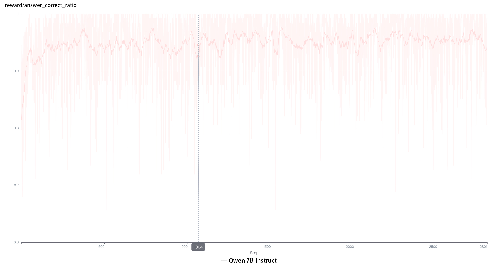
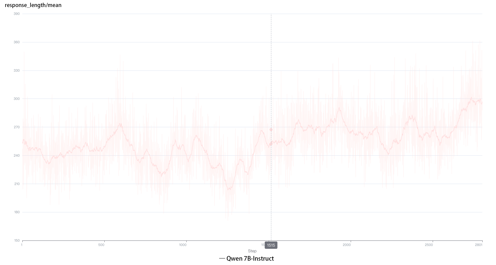
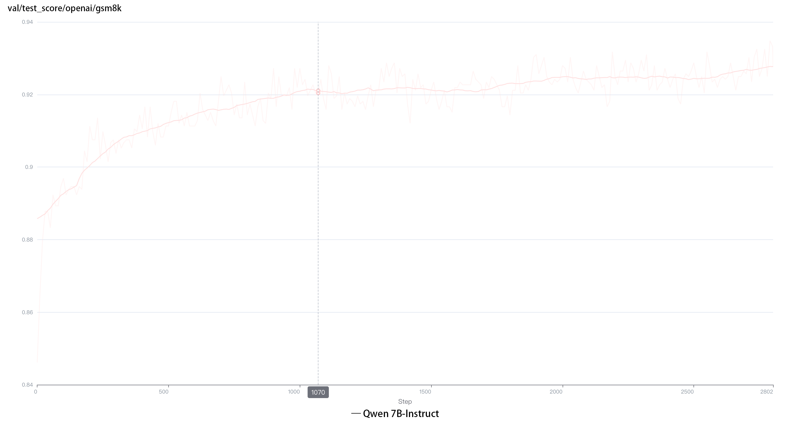
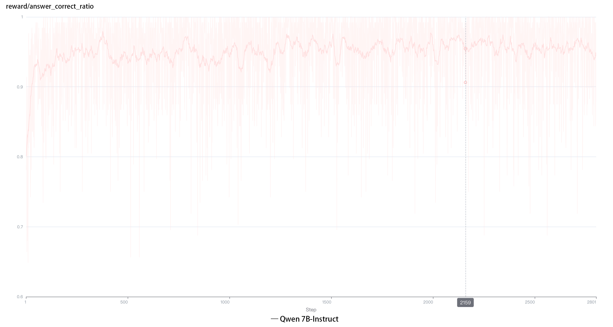
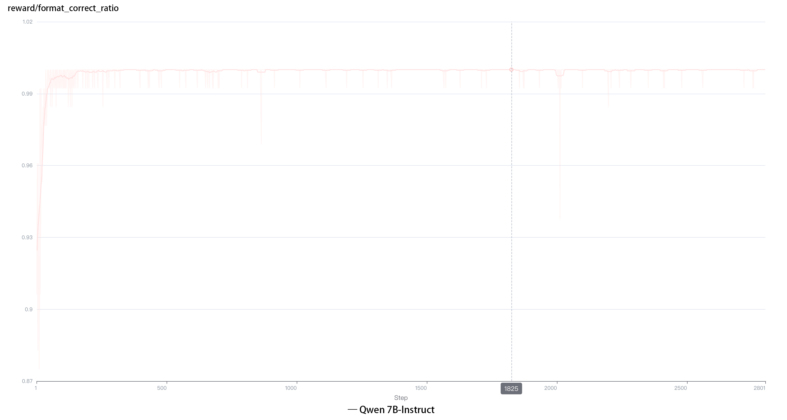
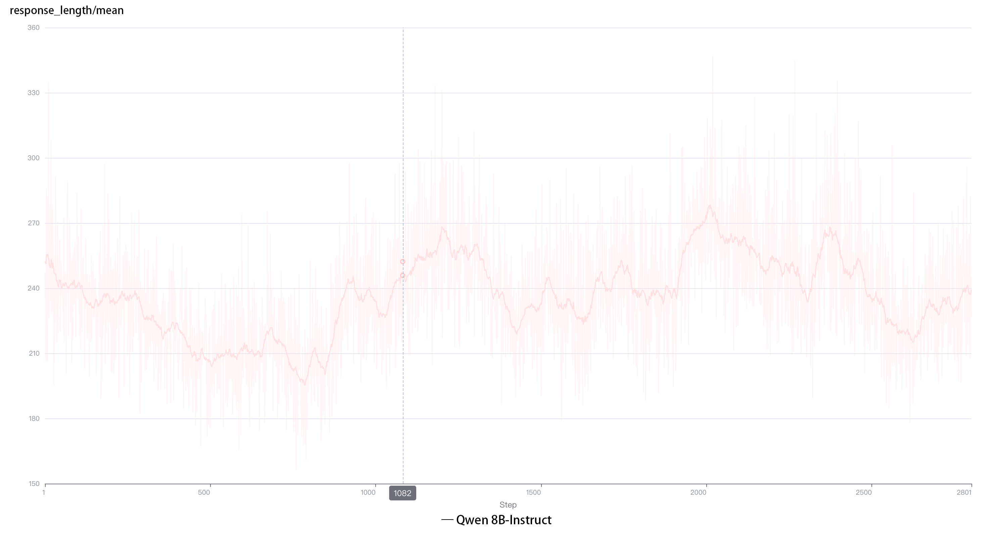
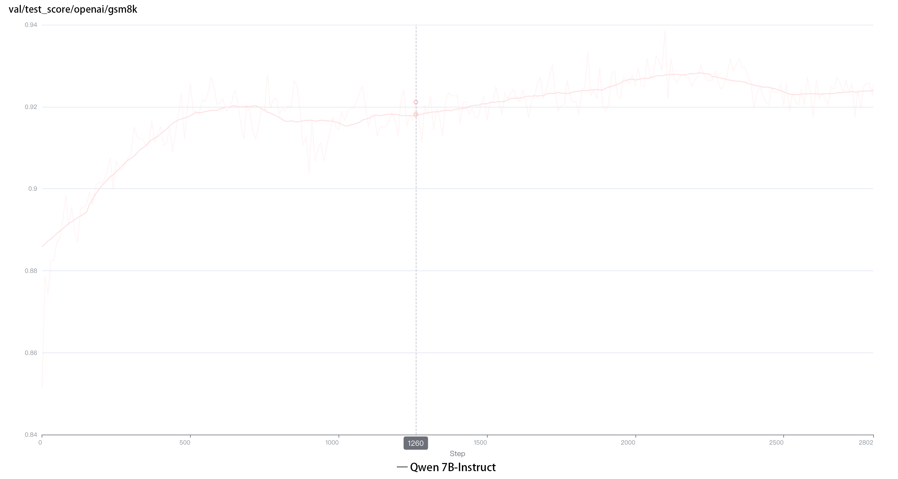

# TinyZeroMathVeRL

TinyZeroMathVeRL is a **toy project** designed to replicate the DeepSeek-R1-Zero at minimal cost, leveraging the gsm8k dataset to validate mathematical reasoning tasks.

## Environment

Please follow the instructions provided in [verl: Volcano Engine Reinforcement Learning for LLM
](https://github.com/volcengine/verl).

## Running

### Data Preparation
```bash
python3 ./examples/data_preprocess/gsm8k_r1_zero.py \ 
--local_dir {local_dir} \
--template_type instruct 
```
### Training
```bash
bash main_grpo.sh
```

## Experimental Setup & Results

### Experimental Setup

**Prompt Design**: the prompt is same as DeepSeek-R1.
```bash
System: You are a helpful assistant. The user asks a question, and the Assistant solves it. The assistant first thinks about the reasoning process in the mind and then provides the user with the answer. The reasoning process and answer are enclosed within <think> </think> and <answer> </answer> tags, respectively, i.e., <think> reasoning process here </think> <answer> answer here </answer>. 
User: {question}. Please reason step by step, and put your final answer within \boxed{}.
```

**Models**: Qwen2.5-Instruct-1.5B & Qwen2.5-Instruct-7B   

**Reward Settings**  
   - **Format Reward** 
     * Follow Format: Reward +0.1 (easy to learn) .
     * Not Follow Format: Reward -1.
     * Format judgment is implemented based on [Logic-RL](https://github.com/Unakar/Logic-RL). 
     
   - **Answer Reward**:  
     * Correct Answer: Reward +2.  
     * Correct Answer but Multiple \boxed{}: Reward +1.5.  
     * Incorrect Answer: Reward -2.  
    
### Experimental Results

   - **Qwen2.5-Instruct-1.5B, Answer Reward only**  
   
   |  |  |  |
   |:---:|:---:|:---:|
   | Answer Reward | Response Length | Valid Answer Accuracy |
   
   
   - **Qwen2.5-1.5B-Instruct, Answer Reward and Format Reward**
   
   |  |  |  |  |
   |:---:|:---:|:---:|:---:|
   | Answer Reward | Format Reward | Response Length | Valid Answer Accuracy |

   - **Qwen2.5-7B-Instruct, Answer Reward only**
   
   |  |  |  |
   |:---:|:---:|:---:|
   | Answer Reward | Response Length | Valid Answer Accuracy |

   - **Qwen2.5-7B-Instruct, Answer Reward and Format Reward** 
     
   |  |  |  |  |
   |:---:|:---:|:---:|:---:|
   | Answer Reward | Format Reward | Response Length | Valid Answer Accuracy |
   
#### Key Observations

1. **Ease of Format Learning**:
   - Even with very small format reward, the format is relatively easy to learn. However, learning the format may not significantly improve answer quality in the simple math reasoning task.

2. **Impact of `\boxed{}` Format**:
   - Using the `\boxed{}` format led to answer improvements in both the 1.5B and 7B models for the reason that the model tended to output a complete sentence within `<answer></answer>` rather than a single numerical answer.
   - For the 7B model, accuracy improved from approximately 80% to 92%.
   - For the 1.5B model, accuracy improved from approximately 68% to 80% (based on reported observations, as no experiments were conducted specifically for the 1.5B model).

3. **Initial Performance of Qwen-1.5B-Instruct**:
   - The initial poor performance of the Qwen-1.5B-Instruct model was largely due to its failure to adhere to the required format. For example:
     - The final answer was placed after the `</answer>` tag instead of within `<answer> </answer>`.
     - The answer was not enclosed in the `\boxed{}` format.

4. **Self-evolution Process on GSM8K Dataset**:
   - The GSM8K dataset might be too simple, as **no self-evolution process** was observed in either the 1.5B or 7B models.

---

     


     