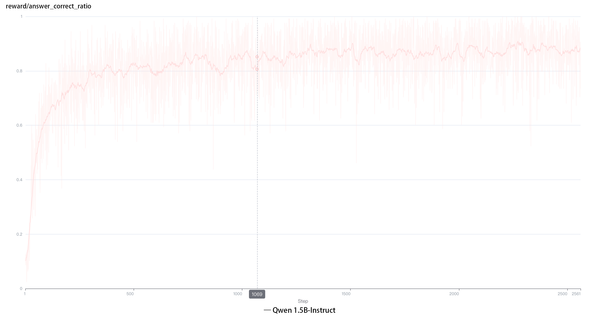
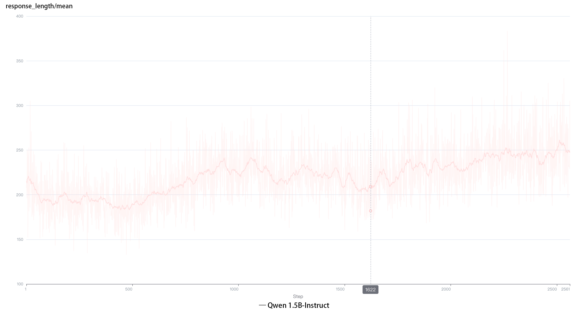
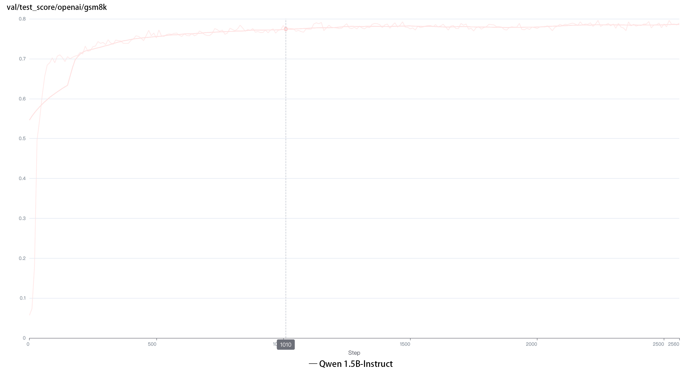
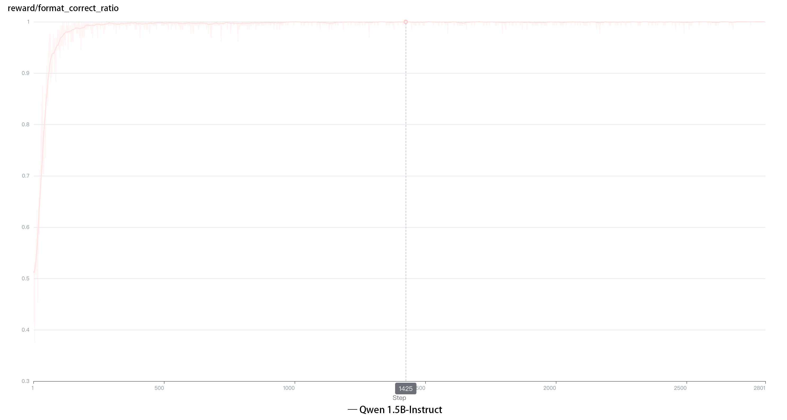
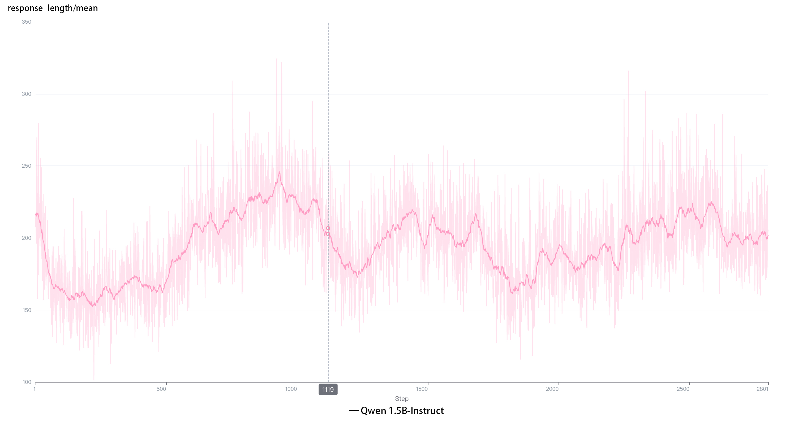
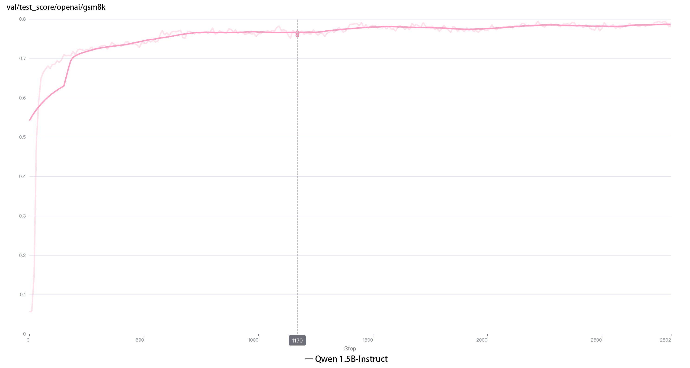

# TinyZeroMathVeRL

TinyZeroMathVeRL is a **toy project** designed to replicate the DeepSeek-R1-Zero at minimal cost, leveraging the gsm8k dataset to validate mathematical reasoning tasks.

## Environment

Please follow the instructions provided in [verl: Volcano Engine Reinforcement Learning for LLM
](https://github.com/volcengine/verl).

## Running

### Data Preparation
```bash
python3 ./examples/data_preprocess/gsm8k_r1_zero.py \ 
--local_dir {local_dir} \
--template_type instruct 
```
### Training
```bash
bash main_grpo.sh
```

## Experimental Setup & Results

**Prompt Design**: the prompt is same as DeepSeek-R1.
```bash
System: You are a helpful assistant. The user asks a question, and the Assistant solves it. The assistant first thinks about the reasoning process in the mind and then provides the user with the answer. The reasoning process and answer are enclosed within <think> </think> and <answer> </answer> tags, respectively, i.e., <think> reasoning process here </think> <answer> answer here </answer>. 
User: {question}. Please reason step by step, and put your final answer within \boxed{}.
```

**Models**: Qwen2.5-Instruct-7B & Qwen2.5-Instruct-1.5B  

**Reward Settings**  
   - **Format Reward** 
     * Follow Format: Reward +0.1 (easy to learn) .
     * Not Follow Format: Reward -1.
     * Format judgment is implemented based on [Logic-RL](https://github.com/Unakar/Logic-RL). 
     
   - **Answer Reward**:  
     * Correct Answer: Reward +2.  
     * Correct Answer but Multiple \boxed{}: Reward +1.5.  
     * Incorrect Answer: Reward -2.  
    
**Experimental Results**  
   - **Qwen2.5-1.5B-Instruct, Answer Reward only**    
     
   - **Qwen2.5-1.5B-Instruct, Answer Reward and Format Reward**  
      
   - **Qwen2.5-1.5B-Instruct, Answer Reward only**  
      
   - **Qwen2.5-1.5B-Instruct, Answer Reward and Format Reward**  
      

     